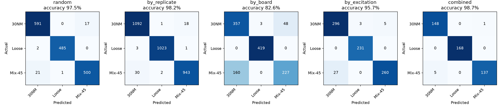
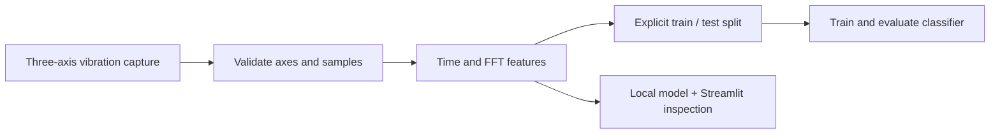

# Code the Sky — Structural Integrity Classifier

**2nd place · Code the Sky Hackathon (2026)**  
Vibration-signal classification, with an explicit test of generalization to unseen sensor boards.

This team hackathon project extracts time-domain and FFT features from three-axis vibration recordings and classifies three laboratory bolt conditions. The public version includes a local training pipeline, a Streamlit inspection interface, reviewed challenge data artifacts and a reproducible evaluation.

## Evidence at a glance

- **8,221 captures · 104 signal features · three condition labels.**
- **82.62% test accuracy on held-out boards:** 7,007 training captures and 1,214 test captures; seed 42.
- **97.46% on a random holdout.** The gap is why split design matters: random recordings share boards and experimental conditions across training and test sets.
- [Evaluation report](reports/evaluation.md), [machine-readable results](reports/evaluation.json), [exact split assignments](reports/split_assignments.csv) and [source checksums](reports/dataset_manifest.csv).



These are fixed, single-seed holdouts with an untuned gradient-boosting baseline. They are not cross-validation or independent field validation. The combined split holds out an intersection of boards and replicates; it is **not** a stricter unseen-board test. The final demonstration model trains on all included captures, so its training accuracy is not a held-out result.

## Signal pipeline



The signals are sampled at 27 kHz. Features include spectral peaks, frequency-band energy and time-domain statistics. Run, board and other experimental identifiers are excluded from model inputs. The code supports gradient boosting, random forest and logistic regression; the published evaluation uses gradient boosting.

## Run from this public checkout

Use Python 3.11+; no cloud account is needed for the local path.

```bash
git clone https://github.com/DKAA04/CODE-THE-SKY_CLEAN-REPO.git
cd CODE-THE-SKY_CLEAN-REPO
python -m venv .venv
source .venv/bin/activate
python -m pip install -r requirements.txt
python scripts/prepare_demo.py
python scripts/train_final_model.py
python -m streamlit run app/streamlit_app.py
```

On Windows PowerShell, activate with `.venv\Scripts\Activate.ps1`. Training can take several minutes. `prepare_demo.py` checks the included feature table's checksum and will not overwrite an existing local table.

Upload one of the three measured captures in [data/examples](data/examples) to inspect its waveform, spectrum and predicted class. These examples also occur in the training table and are demonstration inputs, not independent test cases. Model probabilities are uncalibrated. Only load a model you trained yourself; joblib files from untrusted sources can execute code.

```bash
# Reproduce the five holdouts and regenerate the reports
python scripts/evaluate_reproducible.py

# Validate label handling, input checks and split boundaries
python -m unittest discover -s tests -v
```

## Data and full reproduction

The included feature table supports model training and split evaluation without downloading the full raw archive. [Data provenance and permission](docs/DATA.md) explains the organizer-provided challenge data, included artifacts and limits of the publication permission. No broader data licence or organizer endorsement is implied.

For independent feature-extraction verification, obtain the original authorized archive and preserve this layout:

```text
data/raw/Sensor Board Update Initial Test/
├── Test.csv
└── <A|B|C>/<test_id>/<board>/<timestamp>.csv
```

Then run `python scripts/extract_all_features.py` followed by `python scripts/evaluate_reproducible.py`. The latter hashes the raw CSVs when present; otherwise it keeps the published manifest and records that the source files were not reverified. Generated models and working data stay in ignored `data/processed/`.

## What was improved

The September 2026 portfolio pass, completed with Codex assistance, normalized the two spellings of the partially loosened class, added validation for missing axes, incomplete and non-finite captures, made data loading respect the supplied root, guarded empty/invalid holdouts, and published the evaluation evidence. These changes are separate from the original team hackathon work. This repository does not attribute every team component to one contributor.

The three normalized classes are `30NM`, `Loose` and `Mix-45`. The new evaluation supersedes the earlier unverified local results. Historical BigQuery ML results were not rerun.

## Optional BigQuery ML path

Install `requirements-cloud.txt`, review the identifiers in [src/config.py](src/config.py) and [sql/train_bqml.sql](sql/train_bqml.sql), and configure your own authorized Google Cloud project before using [scripts/upload_features.py](scripts/upload_features.py). Cloud operations may incur charges. The published evaluation calls no cloud services.

## Repository guide

| Area | Files |
| --- | --- |
| Loading and validation | [src/data_loader.py](src/data_loader.py) |
| Signal features | [src/features.py](src/features.py) |
| Split definitions | [src/splitter.py](src/splitter.py) |
| Model baselines | [src/train.py](src/train.py) |
| Recorded evaluation | [scripts/evaluate_reproducible.py](scripts/evaluate_reproducible.py) |
| Interactive inspection | [app/streamlit_app.py](app/streamlit_app.py) |
| Data provenance | [docs/DATA.md](docs/DATA.md) |
| Exploratory commercial proposal | [docs/commercial_bonus.md](docs/commercial_bonus.md) |

## Limits

This is a laboratory classification prototype, not a validated aviation inspection system. Run-specific effects may be confounded with bolt condition. Generalization to other fixtures, unseen faults and operational airports is unproven. Commercial figures are proposal assumptions, not verified operating outcomes.

**Stack:** Python · NumPy · pandas · SciPy · scikit-learn · Streamlit · Plotly; optional BigQuery ML.
